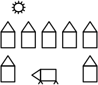
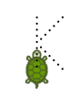
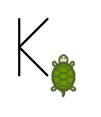
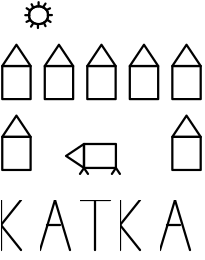

# Úkol 1 (lekce 2) – Želva Žofka

Každou část úkolu vytvořte jako samostatný *commit*.
Pokud zjistíte dodatečně v kódu nějakou chybu, nevadí, commitněte opravu jako další *commit*.
Pokud si chcete práci průběžně zálohovat, po *commitu* udělejte také *push*, čímž se všechny neodeslané commity nahrají na GitHub.

## Část 1
Vytvořte metodu `nakresliPrasatko()`, která nakreslí prasátko jako na obrázku.
Jako bonus můžete dokreslit prasátku i ocásek.
Metodu zavolejte z metody `start` ve třídě `HlavniProgram`, aby se prasátko opravdu nakreslilo do okna aplikace.

[obrázek prasátka](obrazky/ukol01-prasatko.svg)

## Část 2
Pokračujte v projektu a nakreslete několik obrazců podle obrázků níže.
Pro každý obrázek vytvořte speciální metodu (kterou zavoláte z `HlavniProgram`) a případně uvnitř volejte další metody.
Dejte pozor na to, ať se obrázky nepřekrývají (ani s prasátkem).

Poznámka: Želva neumí kreslit zakřivené čáry.
Kolečko a podobné tvary nakreslíte tak, že nakreslíte krátkou čáru (třeba 5 pixelů), potom se otočíte o malý úhel (třeba 20°) a toto opakujete n-krát (třeba 18krát).

## Část 3
Nakreslete kompozici podle obrázku níže.
Použijete pro to metody, které už máte napsané.
Vykreslení obrázků z části 1 a 2 v kódu zakomentujte, aby se do okna vykreslil pouze výsledný obrázek.

Nad nebo pod obrázkem si nechte místo pro své jméno – část 4.

## Část 4
Naučte želvu nakreslit písmena, která máte ve jméně, a nakreslete svoje křestní jméno.
V této části se zaměřte na znovupoužitelnost.
Vytvořte tedy pro každé písmeno metodu (např. `nakresliA()`, `nakresliB()`, … – stačí ta písmena, která máte ve jméně).
U každého písmene začněte vlevo dole (jakoby na spodní lince písmene) a skončete na vpravo dole (na spodní lince písmene) v místě pro další písmeno (za mezerou).
Pokud si disciplinovaně udržíte tento styl v každé metodě, bude možno písmena skládat za sebe v libovolném pořadí.

Pro ukázku uvažujme písmeno „K“.
Tečkovaně je naznačeno, jak ho bude želva kreslit.
Želva je zatím ve výchozí pozici (a písmeno zatím nenakreslila):

Želva písmeno postupně nakreslí a skončí v této pozici:

## Odevzdání úkolu
Na konci budete mít aplikaci, která nakreslí obrázek a nad nebo pod ním bude vaše jméno.
Výsledný obrázek nakreslený v aplikaci může vypadat třeba takhle:

Až budete mít vše hotové, ověřené a commitnete poslední změnu, proveďte *push* na GitHub – tím se všechny vaše commity odešlou na GitHub.
Zkontrolujte si přes webové rozhraní GitHubu (přes prohlížeč), že tam jsou opravdu všechny vaše změny nahrané.
Nakonec vložte odkaz na vaše repository do odevzdávárny domácích úkolů na https://moje.czechitas.cz.

Pokud by vám nešlo *pushnout* kód na GitHub a zobrazila by se chyba, že nemáte dostatečná oprávnění, je to způsobené tím, že jste nenaklonovaly z GitHubu své repository, ale klonovaly jste ode mne – a do mého repository nemáte právo zápisu 😀
Nezoufejte, dá se to snadno spravit, ale je lepší to udělat s lektorem nebo koučem – napište na Slack a někdo vám poradí.

